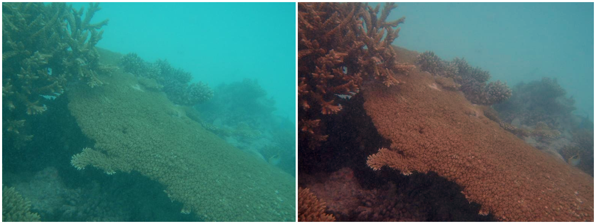

# Underwater Image Color Correction

## Description
Underwater photography is a fascinating field that captures the beauty of the underwater world. However, underwater images often appear bluish or greenish due to the absorption of light by water and the scattering of light by particles in water. To obtain a more accurate and visually appealing representation of the underwater scene, color correction is required.

## Project Steps

### Step 1: Histogram Analysis
The first step in color correction is to analyze the histogram of the RGB channels of the image. From the histogram, we observed that the red channel is concentrated on the left side of the histogram, indicating that the red color gets absorbed due to a higher wavelength. We also observed that in images with a greenish appearance, the histogram of the blue channel is also concentrated toward the left.

### Step 2: Channel Analysis
In addition to the histogram, we also observed the true R, G, and B components of all images to display the degradation of each channel. It was observed that the Green channel is the least degraded as compared to the Red and Blue channel.

### Step 3: Compensation
The compensation process is to add a fraction of the green channel to the Red and Blue (when required) channel as it is the least degraded channel.

### Step 4: White Balancing
After performing the compensation, the next step in color correction is to perform white balancing using the Gray World algorithm. In this algorithm, the average value of R, G, and B channels is calculated and then scaled such that the gray world assumption is satisfied, which assumes that the average color in a natural scene is gray. This results in a more accurate representation of the colors in the image.

## Libraries Used
- Matplotlib: A plotting library used for visualizing the histograms and color-corrected images.
- PIL (Python Imaging Library): A library used for opening, manipulating, and saving images in various formats.
- NumPy: A library used for numerical operations and array manipulation.

## Code
The code for this project is implemented in a Jupyter notebook. Please refer to the notebook file for the detailed implementation.

Note: Ensure that the required libraries are installed before running the code.

## Results

After following these steps, we observed that the color-corrected image had low color distortion and appeared more visually appealing. Color correction is an essential step in underwater image processing and can significantly improve the quality of the images captured in this unique environment.

## Additional Notes
Feel free to experiment with different images and adjust the parameters to achieve optimal color correction results.

Blog Link : https://medium.com/@kirtish1/underwater-image-color-correction-3ab74af627c7

